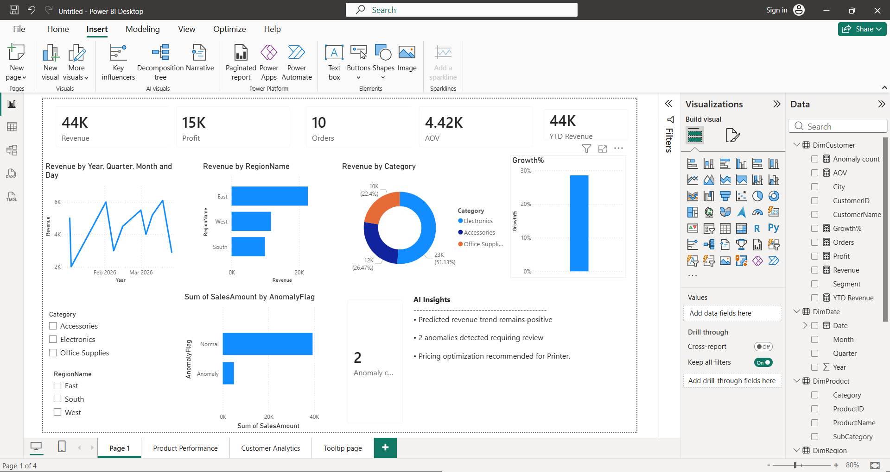
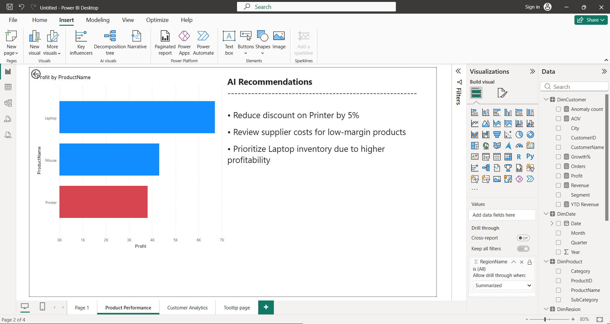
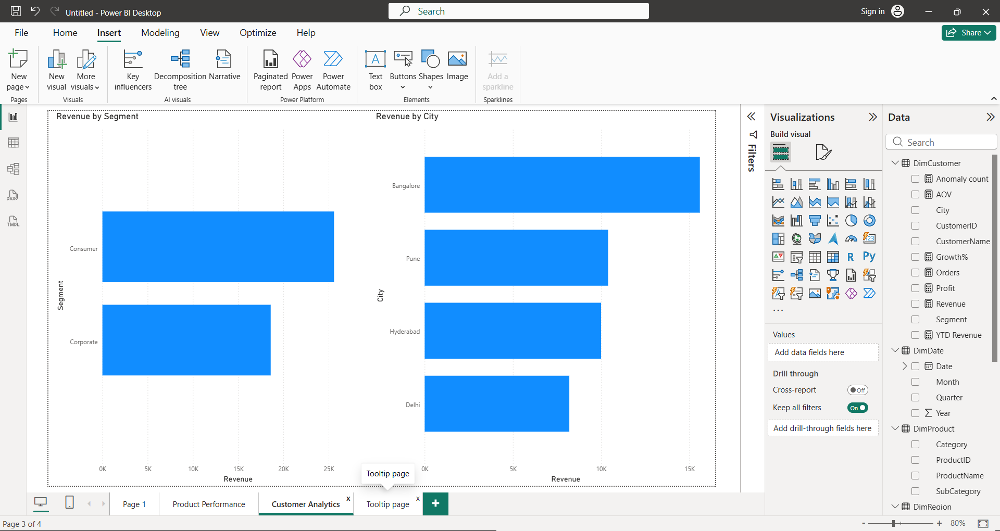

# AI-Driven Retail Sales Intelligence & Decision Support Platform

## 📌 Overview

Dataset Size: 10 Orders | 44K Revenue | 15K Profit | 3 Regions | 3 Product Categories

Built an AI-augmented analytics platform using Power BI, SQL and analytical modeling for revenue analysis, anomaly detection, forecasting and recommendation-driven decision support.

---

## 🚀 Features

* Sales and Profit Dashboard
* Product Profitability Analysis
* Customer Segment Analytics
* Forecasting
* Anomaly Detection
* AI Insights Panel
* Recommendation Engine
* Row-Level Security (RLS)

---

## 🛠 Tech Stack

* Power BI
* SQL
* DAX
* Power Query
* Star Schema Data Modeling

---

## 📊 Key Insights

* East region generated highest revenue (22.6K)
* Laptop is highest-profit product
* Printer identified as low-margin product
* 2 anomalies detected
* Positive revenue trend forecasted

---

## 📂 Repository Structure

## 📊 Executive Dashboard

## 📈 Product Performance

## 👥 Customer Analytics

## 🤖 AI sights

sql/
└── queries.sql (Analytical SQL queries for revenue, profitability and customer analysis)

---

## 🎯 Business Impact

Supports decision-making using predictive, anomaly and recommendation-driven analytics.
